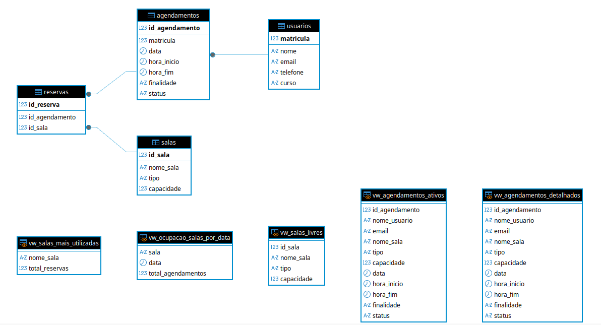

# Sistema de Agendamento – Laboratório de Anatomia (LAPA)

Sistema web para gerenciamento de salas e agendamentos do Laboratório de Anatomia, desenvolvido como atividade acadêmica.

---

Grupo: Daniela Oliveira

---

## 🎯 Objetivo

Facilitar o controle de uso das salas do laboratório, permitindo:

- Cadastro de usuários
- Cadastro de salas
- Criação de agendamentos
- Registro de reservas
- Consulta de disponibilidade

---

## 🧠 Regras de Negócio Implementadas

Não é permitido agendar uma sala em horário já reservado.

Cancelamentos alteram o status para cancelado.

Disponibilidade de salas é calculada dinamicamente.

Blocos de horários são gerados das 08:00 às 18:00.

---

## 🧱 Arquitetura do Sistema

O projeto segue uma arquitetura em camadas:

- **Frontend:** HTML, CSS e JavaScript puro
- **Backend:** Python (FastAPI)
- **Banco de Dados:** MySQL 8
- **Containerização:** Docker e Docker-Compose

Comunicação via API REST utilizando JSON.

---

## 🗄️ Modelagem do Banco de Dados

### Entidades principais

- Usuario
- Sala
- Agendamento
- Reserva

## 🔗 Relacionamentos

Relacionamentos com chaves primárias e estrangeiras, garantindo integridade referencial.
Um usuário pode ter vários agendamentos.
Um agendamento pertence a um usuário.
Um agendamento gera uma reserva.
Uma sala pode ter várias reservas.
Uma reserva liga um agendamento a uma sala.

--- 

📌 Modelo conceitual

https://lucid.app/lucidchart/d1fea927-13ae-4bd2-8b85-e5af8d780775/edit?viewport_loc=-3139%2C-3565%2C2524%2C1340%2C0_0&invitationId=inv_faef2763-0318-4fc4-9ea4-3443acf20d06

O esquema lógico foi obtido a partir da transformação do MERE
para o modelo relacional.

📌 Modelo Entidade Relacionamento

---

## 📖 Dicionário de Dados

Tabela: Usuario
| Campo     | Tipo         | Restrições | Descrição                |
| --------- | ------------ | ---------- | ------------------------ |
| matricula | INT          | PK         | Identificador do usuário |
| nome      | VARCHAR(100) | NOT NULL   | Nome do usuário          |
| email     | VARCHAR(100) |            | Email                    |
| telefone  | VARCHAR(20)  |            | Contato                  |
| curso     | VARCHAR(100) |            | Curso do usuário         |

Tabela: Sala
| Campo      | Tipo         | Restrições | Descrição             |
| ---------- | ------------ | ---------- | --------------------- |
| id_sala    | INT          | PK         | Identificador da sala |
| nome_sala  | VARCHAR(100) | NOT NULL   | Nome da sala          |
| tipo       | VARCHAR(50)  |            | Tipo da sala          |
| capacidade | INT          |            | Capacidade máxima     |

Tabela: Agendamento
| Campo          | Tipo         | Restrições | Descrição                   |
| ----------     | ------------ | ---------- | ----------------------------|
| id_agendamento | INT          | PK         | Identificador do agendamento|
| matricula (FK) | INT          | NOT NULL   | matricula do usuário        |
| data           | date         |            | Data do agendamento         |
| hora_inicio    | time         |            | horário do início do agendam|
| hora_fim       | time         |            | horário do fim do agendam.  |
| finalidade     | varchar(100) |            | Aula, palestra, evento, etc |
| status         | varchar(100) |            | ativo, cancelado            |

Tabela: Reserva
| Campo               | Tipo        | Restrições | Descrição                   |
| -------------       | ------------| ---------- | ----------------------------|
| id_agendamento (FK) | INT         | PK         | Identificador do agendamento|
| nome_sala (FK)      | varchar(100)| NOT NULL   |Nome da sala                 |

## VIEWS

Tabela: Agendamento Detalhado (vw_agendamento_detalhado)

| Field          | Type         | Null | Key | Default | Extra |
|----------------|--------------|------|-----|---------|-------|
| id_agendamento | int          | NO   |     | 0       |       |
| usuario_nome   | varchar(100) | NO   |     | NULL    |       |
| email          | varchar(100) | YES  |     | NULL    |       |
| nome_sala      | varchar(100) | NO   |     | NULL    |       |
| tipo           | varchar(50)  | YES  |     | NULL    |       |
| capacidade     | int          | YES  |     | NULL    |       |
| data           | date         | NO   |     | NULL    |       |
| hora_inicio    | time         | NO   |     | NULL    |       |
| hora_fim       | time         | NO   |     | NULL    |       |
| finalidade     | varchar(255) | YES  |     | NULL    |       |
| status         | varchar(20)  | YES  |     | ativo   |       |

Tabela: Agendamentos ativos (vw_agendamentos_ativos)

| Field          | Type         | Null | Key | Default | Extra |
|----------------|--------------|------|-----|---------|-------|
| id_agendamento | int          | NO   |     | 0       |       |
| usuario_nome   | varchar(100) | NO   |     | NULL    |       |
| email          | varchar(100) | YES  |     | NULL    |       |
| nome_sala      | varchar(100) | NO   |     | NULL    |       |
| tipo           | varchar(50)  | YES  |     | NULL    |       |
| capacidade     | int          | YES  |     | NULL    |       |
| data           | date         | NO   |     | NULL    |       |
| hora_inicio    | time         | NO   |     | NULL    |       |
| hora_fim       | time         | NO   |     | NULL    |       |
| finalidade     | varchar(255) | YES  |     | NULL    |       |
| status         | varchar(20)  | YES  |     | ativo   |       |

Tabela: Salas mais utilizadas (vw_salas_mais_utilizadas)

| Field          | Type         | Null | Key | Default | Extra |
|----------------|--------------|------|-----|---------|-------|
| nome_sala      | varchar(100) | NO   |     | NULL    |       |
| total_reservas | bigint       | NO   |     | 0       |       |

Tabela: Ocupação de salas por data(vw_ocupacao_salas_por_data)

| Field              | Type         | Null | Key | Default | Extra |
|--------------------|--------------|------|-----|---------|-------|
| sala               | varchar(100) | NO   |     | NULL    |       |
| data_agendamento   | date         | NO   |     | NULL    |       |
| total_agendamentos | bigint       | NO   |     | 0       |       |

Tabela: Salas livres (vw_salas_livres)

| Field      | Type         | Null | Key | Default | Extra |
|------------|--------------|------|-----|---------|-------|
| id_sala    | int          | NO   |     | 0       |       |
| nome_sala  | varchar(100) | NO   |     | NULL    |       |
| tipo       | varchar(50)  | YES  |     | NULL    |       |
| capacidade | int          | YES  |     | NULL    |       |

O relatório foi implementado com base nas informações da view vw_agendamentos_detalhados.
A tabela Salas Disponíveis foi implementada com base nas informações da view vw_salas_livres.
---

🎯 Trigger

Foi implementado um gatilho (trigger) no banco MySQL chamado before_insert_agendamento e before_update_agendamento.
Esse trigger automatiza a regra de negócio que define automaticamente o status do agendamento como "finalizado" quando a data e hora informadas forem anteriores ao momento atual.
Dessa forma, o sistema garante integridade e consistência dos dados sem depender da camada de aplicação.

🧪 Como testar 

Inserir um agendamento com data passada.
Consultar tabela.
Verificar que status foi automaticamente definido como finalizado.

--- 

## Povoamento do banco de dados
Manualmente, ou utilizando o auto complete e ajustando os valores manualmente.

---

## 🧪 Normalização

O esquema está normalizado até **no mínimo a Segunda Forma Normal (2FN)**,
eliminando dependências parciais e redundâncias.

---

## 🐳 Como executar o projeto (Docker)

Clonar o repositório: 
git clone https://github.com/danisjc6/agendamento_LAPA
cd agendamento_LAPA

Subir os containers: 
docker-compose up --build

frontend http://localhost:3000
backend http://0.0.0.0:8000/docs

Parar a aplicação: 
docker-compose down

